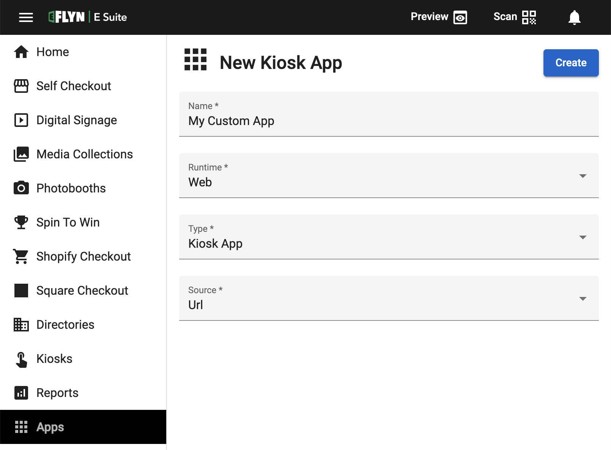

[_metadata_:title]:- 'Adding a Custom App'
[_metadata_:description]:- "Did you know you can add a custom web app to your kiosk in just a few clicks?"
[_metadata_:author]:- "Dawar Rashid"
[_metadata_:tags]:- "custom app,custom apps,web apps,kiosk security,app url"
[_metadata_:date]:- "October 9 2022"
# Adding a Custom Kiosk App

In this article you will see just how quickly and easily you can setup a Custom web-based application to run on the Kiosk Platform.

 

 

1) Click on Apps in the sidebar to goto the Kiosk Apps page. Here you can view all of your custom kiosk apps.
2) Click the + button to create a [new app]({{ DASHBOARD_URL }}/kiosk-apps/new).
3) Give your app a name and confirm the necessary options. Here's an overview of each item when creating a Custom App:
    - **Runtime** refers to the environment your application will be running in. E Suite supports 2 types of runtimes:
      - Web refers to an application that runs exclusively as a browser app. These types of apps can usually be accessed just through a URL or a ZIP upload.
      - Node.js refers to an application that will run inside of a local Node.js runtime on the kiosk.
    - **Type** allows you to specify the type of Custom App you are building. In most cases you can leave this to the default *Kiosk App.* The other options enable you to build custom apps that "override" some of the standard E Suite apps with custom apps.
    - **Source** describes how you intend to deliver your application to the kiosks. Depending on the Runtime selected you will be able to specify either a URL, Upload or respository as a source.
4) Save your custom app.
5) Next you'll want to connect your app using one of the available source methods:
   - ***URL*** Simply paste in the URL that should be loaded for your Custom app in the "URL" tab.
   - ***Upload*** Drag and drop a ZIP archive containing your app onto the dropzone under the "Upload" tab.
6) Now that your application is ready to run all you need to do is enable it on your kiosks! Head over to the [Kiosks]({{ DASHBOARD_URL }}/kiosks) page and select your new Custom App from the activation dropdown next to the Kiosk you want to run it on.

Now you know how to quickly and easily add Custom Apps to your E Suite backend. If you need assistance with anything in this article please do not hesitate to contact us!
