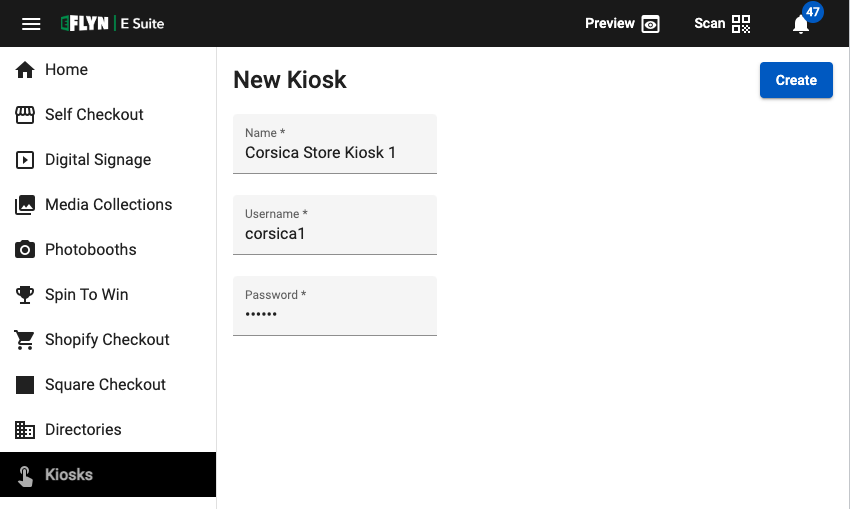

[_metadata_:title]:- 'Setup a Kiosk'
[_metadata_:description]:- "Learn how to setup a new Kiosk and connect it to your E Suite."
[_metadata_:author]:- "Dawar Rashid"
[_metadata_:tags]:- "kiosk setup,new kiosk,kiosks,hardware"
[_metadata_:date]:- "October 9 2022"
# How to Setup a Kiosk on E Suite
#### In this article you will learn how to setup a new kiosk on the E Suite platform.

<iframe width="560" height="315" src="https://www.youtube.com/embed/q3pgJmRSvqM" title="YouTube video player" frameborder="0" allow="accelerometer; autoplay; clipboard-write; encrypted-media; gyroscope; picture-in-picture" allowfullscreen></iframe>
  
### Get your hardware ready

1) Make sure your kiosk is plugged in and turned on.
2) You will need an active internet connection to setup your kiosk. Confirm that there is either Wi-Fi or Ethernet connectivity available on the unit before continuing. You can refer to [this article](https://support.microsoft.com/en-us/windows/setting-up-a-wireless-network-in-windows-97914e31-3aa4-406d-cef6-f1629e2c3721#:~:text=your%20wireless%20network-,In%20Windows%2010,instructions%20if%20there%20are%20any.) for help with setting up your connection.
3) Make sure to download and install the latest version of E Suite Platform on your kiosk. You can find the download link under [Settings.]({{ DASHBOARD_URL }}/settings).

  
### Create a new Kiosk profile

1) To setup a new Kiosk in E Suite visit [this page.]({{ DASHBOARD_URL }}/kiosks/new)
2) Fill in a name for your kiosk. Ideally use this to identify your hardware by adding a store or location name. For example ***Corsica Store Kiosk 1***.
3) Enter a unique username as well as a password that can be used for manual login.

  

4) Click the create button and wait for the kiosk to be ready.  
5) Once the kiosk is ready you can select an application from E Suite to run automatically.

  
### Activate your Kiosk

1) The final step is to connect the new Kiosk profile you just created with your Kiosk hardware. To do this right-click on the E Suite icon in your tray and click Open Admin. The default password is "3274".
2) From this screen Tap the Login button to open up the unique QR code for your device.
3) You'll need to [login to E Suite]({{ DASHBOARD_URL }}/start/login) on a desktop or phone with a camera for this next step.
4) Click the QR code icon on the top right and scan the QR code presented on your kiosk.
5) You will be prompted to select a Kiosk profile to connect to your system. Make your selection and click Done.

Congrats! Your kiosk is now setup and should be running the application that you selected. Any changes you make from now on will automatically be pushed to the kiosk. Try out some things in the backend to see this real-time sync in action.
